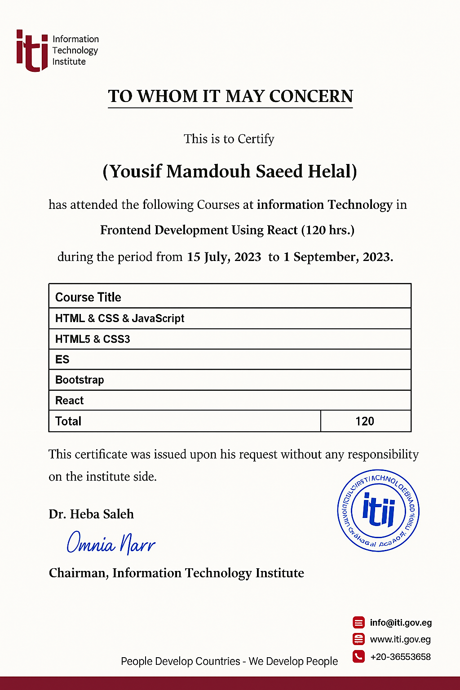

# 🧠 ITI Internship Projects

## <a name="introduction">🎉 Introduction</a>

The **ITI Internship** repository contains various React projects developed during my internship with the Information Technology Institute (ITI). This internship focused on deepening my understanding of React.js, component-based architecture, and modern front-end development practices.

> 📜 **Certificate Included** – Awarded by ITI upon successful completion of the internship program.

> 🛠️ **Note:** This internship played a key role in developing my professional skills in a structured environment, allowing me to apply theoretical knowledge in practical scenarios.

## <a name="tech-stack">⚙️ Tech Stack</a>

- React.js
- JavaScript (ES6+)
- HTML5 & CSS3
- Bootstrap
- Tailwind CSS
- Vite / Create React App

## <a name="features">🔋 Features</a>

👉 **Reusable Components:** Built modular and reusable components to reduce redundancy and improve maintainability.

👉 **Responsive UI:** Employed responsive design principles to ensure all projects work across devices.

👉 **React Hooks:** Utilized `useState`, `useEffect`, and other hooks for functional state management.

👉 **Routing and Navigation:** Implemented client-side routing using React Router.

👉 **Forms and Validation:** Worked with form handling and validations.

👉 **Project Structure:** Followed clean code architecture and folder organization.

## <a name="prerequisites">🔧 Prerequisites</a>

Ensure you have the following installed:

- [Git](https://git-scm.com/)
- [Node.js](https://nodejs.org/)
- [npm](https://www.npmjs.com/) or [yarn](https://yarnpkg.com/)

## <a name="installation">🚀 How to Run</a>

1. **Clone the repository:**

   ```bash
   git clone https://github.com/YousifMHelal/ITI-Internship.git
   ```

2. **Navigate to the project folder:**

   ```bash
   cd ITI-Internship/folderName
   ```

3. **Install dependencies:**

   ```bash
   npm install
   ```

4. **Start the development server:**

   ```bash
   npm start
   ```

5. Open your browser and go to:
   ```
   http://localhost:3000
   ```

## <a name="note">📌 Notes</a>

- This internship was an important milestone in my development journey, helping me build solid foundations in React and frontend technologies.
- All code was written by me as part of hands-on training.
- I gained real-world insights into modern frontend workflows, responsive design, and component-based development.

---

📷 **Certificate Preview:**

